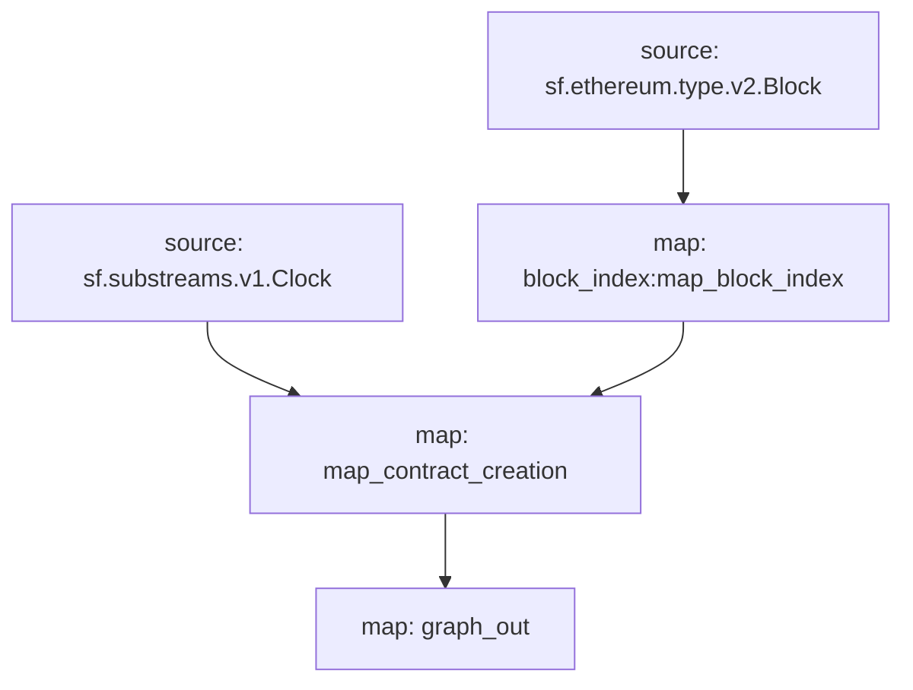

# Subgraph: `Contract Creation`

> Tracks smart contract creation events.

## Data Includes

- [x] Contract Address
- [x] Creator Deployer & Factory
- [x] Creator Transaction Hash & Index
- [x] Contract Code bytecode & Hash
- [x] Contract Input (`init`) bytecode

## Subgraphs

- **API Key**: <https://thegraph.com/studio/apikeys/>
- **Base URL**: <https://gateway.thegraph.com/api>
- **Query URL format**: `{base_url}`/api/`{api-key}`/subgraphs/id/`{subgraph_id}`

| Chain | Subgraph ID | Start Block |
| ----- | ----------- | ------------|
| [Ethereum](subgraphs/mainnet/)   | [`EEWpgBNwW9TzJeHppqyGfRxeK6UuXErg3VVn6EoWjsuc`](https://thegraph.com/explorer/subgraphs/EEWpgBNwW9TzJeHppqyGfRxeK6UuXErg3VVn6EoWjsuc?view=Query&chain=arbitrum-one) | 0 |
| [Arbitrum One](subgraphs/arbitrum-one/)   | [`6w6xFpTo9HHKYYyL7d4HNDy28bG2fMNBiZLcwymoKwAh`](https://thegraph.com/explorer/subgraphs/6w6xFpTo9HHKYYyL7d4HNDy28bG2fMNBiZLcwymoKwAh?view=Query&chain=arbitrum-one) | 22208966 |
| [BNB](subgraphs/bsc/)   | [`7H7M2G2XSLBy7rzWcysC8DpCkEqJQNxMjUKFpgSgMCLc`](https://thegraph.com/explorer/subgraphs/7H7M2G2XSLBy7rzWcysC8DpCkEqJQNxMjUKFpgSgMCLc?view=Query&chain=arbitrum-one) | 0 |
| [Optimism](subgraphs/optimism/)   | [`7RdSF6qXBh1HPFD9A9QV6UvqKCZhrWCXAsGWnCYaWeWE`](https://thegraph.com/explorer/subgraphs/7RdSF6qXBh1HPFD9A9QV6UvqKCZhrWCXAsGWnCYaWeWE?view=Query&chain=arbitrum-one) | 105239153 |

## GraphQL

```graphql
{
  contract_creation(
    orderBy: block_number
    orderDirection: desc
  ) {
    address
    deployer
    code
    code_hash
    from
    to
    factory
    input
    ordinal
    block_hash
    block_number
    block_time
    block_date
    block_month
    transaction_hash
    transaction_index
  }
}
```

## Graph



## Modules

```yaml
Name: map_contract_creation
Initial block: 0
Kind: map
Input: source: sf.substreams.v1.Clock
Input: map: block_index:map_block_index
Output Type: proto:contract_creation.v1.Events
Hash: a003944925bdeca9470fd20078f042e158a1191c

Name: graph_out
Initial block: 0
Kind: map
Input: map: map_contract_creation
Output Type: proto:sf.substreams.sink.entity.v1.EntityChanges
Hash: 1a168932f997af5283526d4bf56cc2311649818c

Name: block_index:map_block_index
Initial block: 0
Kind: map
Input: source: sf.ethereum.type.v2.Block
Output Type: proto:sf.ethereum.type.v2.Block
Hash: 6c09d386577f8c62fe1b3f1cf50622bb0f08a48a
```

## Subgraph deployment

```bash
graph indexer rules prepare --network arbitrum-one <Qm>
graph indexer allocations create <Qm> arbitrum-one 100
```

## Build

### Docker

```bash
docker build -t subgraph-contract-creation
docker run -it subgraph-contract-creation
```

### Local

> [!IMPORTANT]
> Requires [`substreams`](https://github.com/streamingfast/substreams/releases/latest), [`buf`](https://buf.build/product/cli) and [`graph`](https://github.com/graphprotocol/graph-tooling/releases/latest) CLIs installed as well as [Rust](https://rustup.rs/) with [`wasm32-unknown-unknown` target](https://doc.rust-lang.org/beta/rustc/platform-support/wasm32-unknown-unknown.html#building-rust-programs).

```bash
make [all]
```

#### Contract creation substream

```bash
make spkg-build
```

#### Contract creation block index

```bash
make block-index
```

#### Subgraphs

```bash
make subgraph-build-[mainnet|...|all]
```
