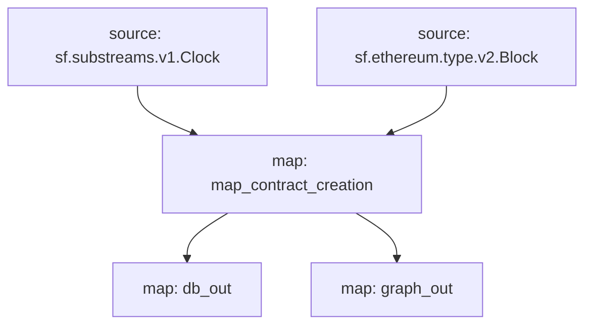

# Subgraph: `Contract Creation`

> Tracks smart contract creation events.

## Data Includes

- [x] Contract Address
- [x] Creator Address
- [x] Creator Factory
- [x] Creator Transaction Hash
- [x] Code
- [ ] Init

## Subgraphs

- **API Key**: <https://thegraph.com/studio/apikeys/>
- **Base URL**: <https://gateway.thegraph.com/api>
- **Query URL format**: `{base_url}`/api/`{api-key}`/subgraphs/id/`{subgraph_id}`

| Chain | Subgraph ID |
| ----- | ----------- |
| Ethereum   | [`EEWpgBNwW9TzJeHppqyGfRxeK6UuXErg3VVn6EoWjsuc`](https://thegraph.com/explorer/subgraphs/EEWpgBNwW9TzJeHppqyGfRxeK6UuXErg3VVn6EoWjsuc?view=Query&chain=arbitrum-one) |
| Arbitrum One   | [`6w6xFpTo9HHKYYyL7d4HNDy28bG2fMNBiZLcwymoKwAh`](https://thegraph.com/explorer/subgraphs/6w6xFpTo9HHKYYyL7d4HNDy28bG2fMNBiZLcwymoKwAh?view=Query&chain=arbitrum-one) |
| BNB   | [`7H7M2G2XSLBy7rzWcysC8DpCkEqJQNxMjUKFpgSgMCLc`](https://thegraph.com/explorer/subgraphs/7H7M2G2XSLBy7rzWcysC8DpCkEqJQNxMjUKFpgSgMCLc?view=Query&chain=arbitrum-one) |

## GraphQL

```graphql
{
  contract_creation(
    orderBy: block_number
    orderDirection: desc
  ) {
    block_number
    block_time
    block_date
    contract_address
    creator_address
    creator_factory
    creator_tx
    code
  }
}
```

## Graph



## Modules

```yaml
Name: map_contract_creation
Initial block: 0
Kind: map
Input: source: sf.substreams.v1.Clock
Input: source: sf.ethereum.type.v2.Block
Output Type: proto:contract_creation.v1.Events
Hash: 55c8099c4dc52893720f63f99efb871920c88b01

Name: db_out
Initial block: 0
Kind: map
Input: map: map_contract_creation
Output Type: proto:sf.substreams.sink.database.v1.DatabaseChanges
Hash: b09283b1a9800ede86e60f5c8ce34f3d8be8e484

Name: graph_out
Initial block: 0
Kind: map
Input: map: map_contract_creation
Output Type: proto:sf.substreams.sink.entity.v1.EntityChanges
Hash: e148d3545043518d7b1072f941c33e0b69a6c0cb
```

## Subgraph deployment

```bash
graph indexer rules prepare --network arbitrum-one <Qm>
graph indexer allocations create <Qm> arbitrum-one 100
```
