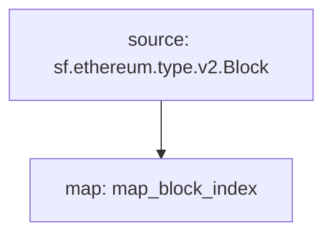

## Subgraph: `Contract Creation`

This function will filter out all the transaction traces that are not contract creations.

Improves Substreams caching performance by reducing the amount of bytes that needs to be read.

## How to use?

Update your `substreams.yaml` with the following:

```yaml
imports:
  block_index: ./block-index/contract-creation-block-index-v0.2.0.spkg

modules:
 - name: map_contract_creation
   kind: map
   inputs:
    - source: sf.substreams.v1.Clock
    - map: block_index:map_block_index
   output :
    type: proto:contract_creation.v1.Events
```

## Graph



## Map Modules

```bash
Name: map_block_index
Initial block: 0
Kind: map
Input: source: sf.ethereum.type.v2.Block
Output Type: proto:sf.ethereum.type.v2.Block
Hash: 6c09d386577f8c62fe1b3f1cf50622bb0f08a48a
```
